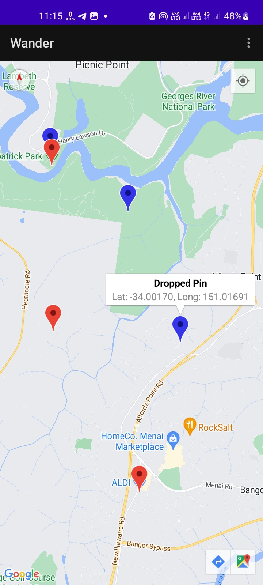
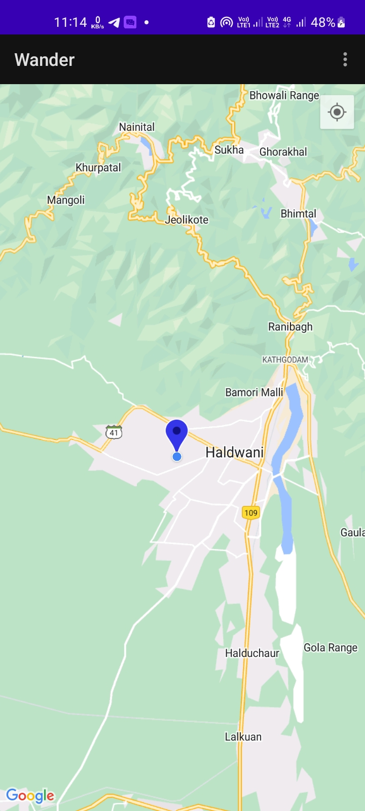

# Wander #

This is sample app that uses Google Maps Fragment with different map types, map styling and marker
styling. It also tracks user location on map.

## App Preview ##

 

## MapFragment ##

`SupportMapFragment` class is a subclass of the `Fragment` class. It is used to add map in an
application. It’s a wrapper around a view of a map to automatically handle the necessary life cycle
needs. You can include SupportMapFragment in a layout file using a `<fragment>` tag in
any `ViewGroup`, with an additional attribute:

```
android:name="com.google.android.gms.maps.SupportMapFragment"
```

Activity that instantiates `SupportMapFragment` calls `getMapAsync()` method to automatically
initialize the maps system and the view.

The activity that contains the `SupportMapFragment` must implement the `OnMapReadyCallback`
interface and that interface's `onMapReady()` method. The `onMapReady()` method is called when the
map is loaded.

Use this site to create a style for the map. https://mapstyle.withgoogle.com/